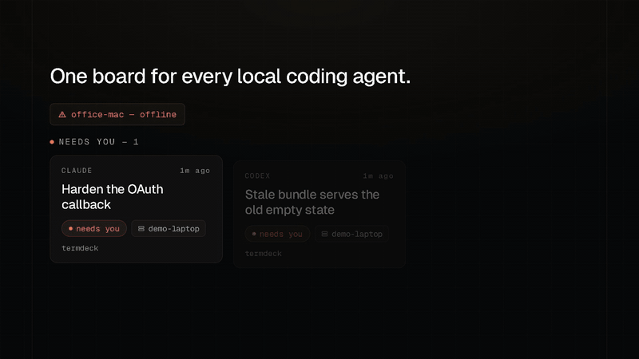

<div align="center">

# Termdeck

### The agents are running. Go live your life.

**Web control plane for the coding-agent CLIs already on your machines.**
Claude Code, OpenAI Codex CLI and Grok: one fleet board, every device, tool approvals on your phone.

[**termdeck.io**](https://termdeck.io?ref=github) · [Install](#install) · [How it works](#how-it-works) · [FAQ](#faq)

<br />

[](https://termdeck.io?ref=github)
[](https://termdeck.io?ref=github)
[](docs/INVARIANTS.md)
[](#three-engines-one-ui)
[](LICENSE)
[](https://instagram.com/termdeck)

<br />



</div>

<br />

## The minute after

The agents already run fine. That was never the hard part.

The hard part is the minute after. A run stops on a tool approval and **sits there** until you
happen to wander back to the terminal. Overnight runs die at 2am on a one-tap decision. Three
sessions across two machines become three terminals you have to remember to check. A laptop lid
closes and the SSH session goes with it.

Termdeck is the board that watches all of it, and pushes you the one moment that needs a human.

<br />

## Disk is the source of truth

This is the design, and it is the one claim a wrapper cannot copy.

Termdeck does not run agents in its own sandbox and it does not keep its own copy of your
conversations. It renders **the CLI's own session files, on your machine**:
`~/.claude/projects/<slug>/<id>.jsonl`, `$CODEX_HOME/sessions`, `~/.grok`.

Three things fall out of that, for free:

- **Every session shows up.** Not just the ones you started through Termdeck. Open the dashboard on a
  fresh machine and a year of terminal history is already there, searchable.
- **Round-trip parity is 100%.** A session you unblocked from your phone on the train still opens with
  `claude --resume <id>` at your desk. Native storage, real cwd, no export step.
- **A terminal-attached session streams live**, in view-only, with a **Take over** button that closes
  the idle terminal client and hands you the composer.

<br />

## Three engines, one UI

| | Claude Code | OpenAI Codex CLI | Grok |
|---|:---:|:---:|:---:|
| Render every past session | ● | ● | ● |
| Drive turns from the browser | ● | ● | ● |
| Inline tool approvals | ● | ● | ● |
| Steer a running turn mid-flight | ● | ● | ● |
| Model + reasoning effort per turn | ● | ● | ● |
| Native plan mode | ● | ● | ○ |
| Resumable in its own CLI afterwards | ● | ● | ● |

The engine is picked per chat. They share one sidebar, one transcript renderer and one permission
card, so there is nothing new to learn when you switch.

<br />

## What you get

|  | |
|---|---|
| **One fleet board** | Every machine you connect: laptop, desktop, VM, the box under the desk. Sessions sorted by who needs you, not by which terminal they live in. |
| **Approve from your phone** | Web Push fires with no browser open and deep-links straight into the session. Allow once / always / deny. |
| **Answer the agent inline** | `AskUserQuestion` renders as real options. No switching to a terminal to type `2`. |
| **Take over a terminal session** | The view-only lock, released. Close the idle CLI client and drive from the web. |
| **Switch model and effort mid-run** | Per turn. Drop to a cheap model for the mechanical part, jump to the big one for the hard part. |
| **Docked diff review** | Changed files with +/− counts, next to the transcript. Not log archaeology. |
| **Fleet-wide search** | Every session on every machine, by prompt, project or host. |
| **Cost and pace meters** | API-equivalent cost per project, token totals, cache-read rate, and 5-hour / weekly / daily limit pacing before you hit the wall. |
| **Install to your home screen** | PWA. Offline shell, 0-RTT paint, push subscription per device. |

<br />

## Install

Two minutes, and no inbound port on your machine.

**1.** Sign in at [termdeck.io/cloud](https://termdeck.io/cloud?ref=github) with GitHub, or email and password.

**2.** Add a machine. You get a one-liner carrying that machine's token:

```bash
curl -fsSL https://termdeck.io/install.sh | TERMDECK_AGENT_TOKEN=agt_… sh
```

```powershell
$env:TERMDECK_AGENT_TOKEN="agt_…"; iwr https://termdeck.io/install.ps1 | iex
```

**3.** Open the dashboard. Your sessions are already there.

macOS, Linux and Windows. The agent installs as a user service (`launchd` / `systemd --user` /
`schtasks`) and keeps itself updated. Full unit templates in [deploy/AGENT-SETUP.md](deploy/AGENT-SETUP.md).

<br />

## How it works

The agent **dials out** over a reverse WebSocket. There is no inbound port, no firewall rule and no
tunnel on your side.

```
your machine                          termdeck.io
┌────────────────────────┐            ┌──────────────────────────┐
│ ~/.claude  ~/.codex    │            │  master                  │
│      ▲                 │            │   ├─ session index       │
│      │ watch + read    │            │   ├─ browser WebSocket   │
│ ┌────┴─────┐           │            │   └─ Web Push            │
│ │  agent   │ ──── reverse WS ────▶  │                          │
│ └────┬─────┘   (dial-out, TLS)      └───────────┬──────────────┘
│      │ spawn                                    │
│  claude / codex / grok                      your browser
└────────────────────────┘                    (phone, laptop, tablet)
```

**The agent is in this repo.** Read it before you run it. That is why it is here. It is confined to
the transcript roots, redacts its own token out of its logs, never logs anything it serves, and
stages every self-update behind a compile check with a `.rollback/` snapshot and two watchdogs.

Start at [`agent/agent.js`](agent/agent.js) and [`agent/capabilities.js`](agent/capabilities.js).
The second one is the whole list of what a machine will answer.

<br />

## Built in the open, and written down

**53 load-bearing invariants**, each one carrying the failure that produced it:
[docs/INVARIANTS.md](docs/INVARIANTS.md).

> **A preview is a PAINT, read from the TAIL.** Seeds and `?tail=1` parse only the file's last bytes;
> `startLine` keeps `totalLines` exact, because it is the cursor every `?since` splice rides.

> **A delta may only be spliced onto the cursor it was fetched at.** A live push landing inside a
> `?since` fetch is what duplicated the transcript, on screen *and* in the cache, whenever a second
> chat was live.

<div align="center">

**1,753** commits · **609** production deploys · **48** days
**123k** lines · **306** test files · **53** invariants · **0** build steps

</div>

<br />

## Compared to

| | Termdeck | Happy | claudecodeui | Claude Remote Control |
|---|:---:|:---:|:---:|:---:|
| Claude Code | ● | ● | ● | ● |
| OpenAI Codex CLI | ● | ○ | ○ | ○ |
| Grok | ● | ○ | ○ | ○ |
| Sees sessions it didn't start | ● | ○ | ● | ○ |
| Multi-machine fleet board | ● | ○ | ○ | ○ |
| Push approval to phone | ● | ● | ○ | ● |
| Take over a terminal session | ● | ○ | ○ | ○ |
| Resumable in the CLI afterwards | ● | ○ | ● | ● |

Anthropic's Remote Control is good and it is free with Pro, if you run one machine, one engine, and
only the sessions you opted in. Termdeck is for the case after that.

<br />

## FAQ

#### Can I approve Claude Code permissions from my phone?

Yes. That is the feature the product exists for. When a turn blocks on a tool approval, Web Push
fires with no browser open, deep-links into the session, and you tap Allow once, Always, or Deny. The
run continues from your pocket.

#### Is there a self-hosted version?

No, and deliberately. There is one way to run Termdeck: connect a machine to your account and drive
it through the cloud. Your code and your transcripts never leave your machine (the agent reads and
renders them in place), but the control plane is hosted.

#### Does a session I drive from the browser still work in the terminal?

Yes. `claude --resume <id>` and `codex resume <id>`. Native storage, real cwd, and Codex resumes the
thread before every web turn so terminal appends are picked up. Round-trip parity is a hard rule, and
it is tested.

#### Does it work with Codex CLI?

Yes. Full turn driving over a long-lived `codex app-server` JSON-RPC child, including native plan
mode. Termdeck is the only web UI that drives both Claude Code and Codex.

#### What can the agent actually touch?

The transcript roots, and nothing else. Capability frames are confined there, and paths are never
sent from the server: the master names a session id and the agent resolves it against its own disk.
The one write outside those roots is checkpoint restore, and it works the same way: ids in, never
paths. The code is in [`agent/capabilities.js`](agent/capabilities.js).

#### What does it cost?

Free while you connect one machine. Paid plans add machines and concurrent sessions. You bring your
own Claude / Codex / Grok subscription; Termdeck never resells inference.

<br />

## What's in this repo

This repo is the **agent and the documentation**: the parts that run on your machine, so you can
read them before you trust them. The hosted control plane (session index, browser WebSocket, push,
billing) is not open source.

```
agent/                 the thin agent: root-confined capabilities, self-update, log redaction
install.sh / .ps1      the one-liners the dashboard hands you
deploy/                systemd / launchd / schtasks units, heal + uninstall scripts
docs/ARCHITECTURE.md   how the pieces fit
docs/INVARIANTS.md     53 load-bearing rules and the failure behind each one
```

### Why some `agent/` files are one line

Several modules in `agent/` are stubs that read:

```js
module.exports = require('../lib/transcript');
```

They are placeholders, not the implementation. The transcript parsers and disk primitives
are **shared between the master and the agent**, and the master distributes them to each
machine at install and update time (an `AGENT_FILES` manifest), so an installed agent under
`~/.termdeck/agent/` has the full modules sitting flat beside `agent.js`.

There is one copy of those rules, on purpose. Two copies of a transcript parser drift, and
a drifted parser is how you get a chat that renders differently depending on which side read
it. The stub is what keeps a repo-run agent pointing at the same file rather than a fork of
it.

The practical consequence: **cloning this repo and running `node agent/agent.js` will not
work**. Those requires have nothing to resolve to here. Install via the one-liner above,
which fetches a complete agent. What is fully present in this repo is the agent's own code:

| File | Lines | What it is |
|---|---:|---|
| [`agent/capabilities.js`](agent/capabilities.js) | 1,599 | the entire capability surface, the trust boundary |
| [`agent/limits.js`](agent/limits.js) | 710 | rate-limit and usage reading |
| [`agent/agent.js`](agent/agent.js) | 646 | dial-out, reconnect, self-update with rollback |
| [`agent/log.js`](agent/log.js) | 105 | bounded, rotated, token-redacted logging |

If you are auditing what a Termdeck machine will do, `capabilities.js` is the file. Nothing
outside it is reachable over the tunnel.

<br />

<div align="center">

### Your agents are already running.

**[Start at termdeck.io →](https://termdeck.io?ref=github)**

If this is the thing you keep wishing existed, a ⭐ helps other people find it.

<sub>Built by <a href="https://bhavikp.in">Bhavik Patel</a> · <a href="https://termdeck.io?ref=github">termdeck.io</a> · <a href="https://instagram.com/termdeck">@termdeck</a></sub>

</div>
